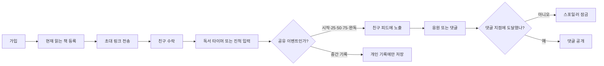

# 책결 제품 설계서

- 문서 상태: MVP 기준안
- 기준일: 2026-08-20
- 제품명: 책결(가칭)
- 한 줄 정의: 가까운 사람들이 서로 다른 책을 읽으면서도 독서 근황을 자연스럽게 공유하는 모바일 앱

## 1. 전제와 결정 대기 항목

현재 설계는 다음을 전제로 합니다.

1. 첫 시장은 한국의 성인 독자다.
2. iOS와 Android를 동시에 제공한다.
3. 핵심 관계는 공개 팔로워가 아니라 상호 수락한 친구다.
4. 앱 안에서 책 본문을 제공하지 않는다.
5. 진척은 페이지, 퍼센트, 독서 시간으로 수동 기록하고 타이머를 지원한다.

이 전제가 달라질 때 나타나는 구체적인 변화는 다음과 같습니다.

- 어린이가 핵심 사용자면 보호자 동의, 학교 계정, 공개 범위 기본값을 다시 설계해야 한다.
- 공개 팔로우가 핵심이면 빈 피드 방지를 위한 추천·크리에이터·신고 운영이 MVP로 올라온다.
- 전자책 본문을 제공하면 DRM, 출판 계약, 결제, 콘텐츠 보안이 제품의 주 업무가 된다.
- 독서모임 전용 앱이면 서로 다른 책을 읽는 친구 간 일상 공유라는 차별점이 사라진다.

## 2. 해결할 문제

독서 기록 앱은 혼자 쓰기 좋고, 독서 커뮤니티는 공개 리뷰나 같은 책 모임에 강하다. 그러나 가까운 사람들이 각자 다른 책을 읽을 때 다음 질문에 답하기 어렵다.

- 요즘 무슨 책을 읽고 있는가?
- 얼마나 읽었고 최근에도 꾸준히 읽고 있는가?
- 스포일러 없이 어느 지점까지 대화해도 되는가?
- 부담을 주지 않으면서 어떻게 응원할 수 있는가?

책결은 공개 서평 SNS가 아니라 **친밀한 관계의 독서 존재감(ambient reading presence)**을 제공한다.

## 3. 대상 사용자와 핵심 작업

### 3.1 주 사용자

- 친구나 연인과 서로 읽는 책을 알고 싶은 가벼운 독자
- 독서 습관을 만들고 싶은 2~10명의 친구 그룹
- 정기 모임은 부담스럽지만 느슨하게 함께 읽고 싶은 사용자

### 3.2 핵심 JTBD

> 친구와 같은 책을 읽지 않더라도 서로 독서를 이어가고 있다는 느낌을 받고, 이야기할 적절한 순간을 알고 싶다.

### 3.3 부 사용자

- 같은 책을 비동기적으로 읽으며 스포일러 없는 대화를 원하는 사용자
- 가족 구성원의 독서 습관을 함께 응원하려는 성인 가족

## 4. 제품 원칙

1. **작은 관계가 먼저다.** 친구가 한 명만 있어도 쓸모 있어야 한다.
2. **비교보다 동행이다.** 공개 순위와 벌점 대신 공동 기록과 응원을 사용한다.
3. **기록 부담을 줄인다.** 타이머 종료나 페이지 입력 한 번으로 개인 기록과 공유가 함께 끝난다.
4. **스포일러를 구조적으로 막는다.** 경고 문구에 의존하지 않고 진척 지점으로 잠근다.
5. **공유는 사용자가 통제한다.** 메모, 정확한 페이지, 독서시간의 공개 범위를 각각 선택한다.
6. **책 형식에 중립적이다.** 종이책, 전자책, 오디오북을 같은 퍼센트 축으로 비교한다.

## 5. 정보 구조

하단 탭은 MVP에서 세 개만 둔다.

| 탭 | 목적 | 핵심 내용 |
|---|---|---|
| 함께 | 친구 독서 상황 확인 | 마일스톤 피드, 현재 읽는 친구, 응원, 스포일러 잠금 대화 |
| 기록 | 내 독서 갱신 | 현재 책, 타이머, 페이지/%/시간 입력, 짧은 감상 |
| 나 | 내 독서와 관계 관리 | 책장, 통계, 친구·그룹, 공개 범위, 알림 설정 |

검색은 독립 탭이 아니라 `기록` 화면의 책 추가 흐름과 `함께` 화면 상단 검색에서 연다.

## 6. 핵심 사용자 흐름

### 6.1 첫 사용

1. Apple·Google·카카오 중 하나로 가입한다.
2. 닉네임과 기본 공개 범위를 정한다.
3. 검색 또는 ISBN 바코드로 현재 읽는 책을 등록한다.
4. 연락처 업로드 없이 초대 링크나 QR로 친구를 초대한다.
5. 친구가 수락하면 양쪽의 `함께` 화면에 현재 책 카드가 나타난다.

연락처 전체 업로드는 MVP에 포함하지 않는다. 첫 연결이 어렵다는 데이터가 확인될 때 해시 기반 연락처 찾기를 별도 동의로 검토한다.

### 6.2 독서 기록

1. `기록`에서 책을 선택한다.
2. 타이머를 시작하거나 현재 페이지·퍼센트를 입력한다.
3. 선택적으로 한 줄 감상과 공개 범위를 지정한다.
4. 기록은 즉시 개인 통계에 반영된다.
5. 공유 마일스톤을 넘었으면 하나의 피드 이벤트를 생성한다.

### 6.3 같은 책 대화

1. 친구 카드에서 같은 책을 읽는 사람을 확인한다.
2. 자신의 현재 위치에 묶인 댓글을 남긴다.
3. 뒤처진 친구에게는 작성자와 위치만 보이고 본문은 잠긴다.
4. 친구가 해당 위치에 도달하면 알림과 함께 댓글이 열린다.

## 7. 화면 설계

### 7.1 함께 홈

상단부터 다음 순서로 구성한다.

1. `지금 읽는 친구` 가로 목록: 책 표지, 이름, 진척, 마지막 독서 시점
2. 시간순 마일스톤 피드
3. 각 카드의 `응원`, `한마디`, `같이 읽기`
4. 잠긴 댓글은 내용 대신 `52%에서 열려요`를 표시

피드 기본 이벤트는 다음과 같다.

- 책을 읽기 시작함
- 25%, 50%, 75%에 도달함
- 책을 완독하거나 중단함
- 사용자가 직접 공유한 한 줄 감상
- 그룹의 주간 공동 기록

독서 세션마다 이벤트를 만들지 않는다. 같은 사용자의 이벤트가 2시간 안에 여러 개 생기면 가장 높은 진척 하나로 합친다.

### 7.2 기록 홈

- 현재 읽는 책 목록
- 큰 `독서 시작` 버튼
- 페이지·퍼센트·오디오 시간 직접 입력
- 타이머 종료 시 시작/종료 페이지 확인
- 메모 입력과 공개 범위
- 과거 날짜 기록 수정

오프라인에서도 세션을 저장하고 네트워크 복구 후 동기화한다.

### 7.3 책 상세

- 내 상태와 진척
- 이 책을 읽는 친구
- 나의 세션·메모 타임라인
- 현재 위치까지 열린 친구의 감상
- 에디션 변경과 전체 분량 수정

### 7.4 나

- 읽는 중, 읽고 싶음, 완독, 잠시 멈춤, 중단 책장
- 주·월·연간 권수, 페이지, 시간 통계
- 친구와 그룹 관리
- 기본 공개 범위 및 책별 예외
- 알림, 차단, 신고, 데이터 내보내기, 계정 삭제

## 8. 기능 요구사항

### 8.1 계정과 관계

- `FR-001` 사용자는 소셜 로그인으로 가입할 수 있다.
- `FR-002` 사용자는 만료되는 초대 링크 또는 QR을 만들 수 있다.
- `FR-003` 친구 관계는 요청·수락·거절·삭제·차단 상태를 가진다.
- `FR-004` 차단 즉시 양쪽 피드·검색·댓글·그룹 초대에서 서로를 제거한다.
- `FR-005` 사용자는 최대 20명의 비공개 그룹을 만들 수 있다.

### 8.2 책과 독서 상태

- `FR-101` ISBN, 제목, 저자 검색으로 에디션을 등록한다.
- `FR-102` 종이책은 페이지, 전자책은 퍼센트, 오디오북은 재생시간을 입력할 수 있다.
- `FR-103` 상태는 `읽고 싶음`, `읽는 중`, `잠시 멈춤`, `완독`, `중단`을 지원한다.
- `FR-104` 재독은 동일 책에 새 독서 회차를 만든다.
- `FR-105` 잘못 입력한 진척을 낮출 수 있지만 수정 이력을 남기고 기존 공개 이벤트를 재계산한다.

### 8.3 공유와 피드

- `FR-201` 공개 범위는 `나만`, `친구`, `특정 그룹`, `공개`를 지원한다.
- `FR-202` 정확한 진척은 `숨김`, `마일스톤만`, `정확히` 중 선택한다.
- `FR-203` 피드는 시작·25·50·75·완독 이벤트를 자동 생성한다.
- `FR-204` 사용자는 자동 공유를 책별로 끌 수 있다.
- `FR-205` 친구는 응원 반응을 한 번만 남기고 취소할 수 있다.
- `FR-206` 피드는 차단·친구 해제·공개 범위 변경을 즉시 반영한다.

### 8.4 스포일러

- `FR-301` 댓글은 페이지, 퍼센트 또는 챕터 위치에 묶인다.
- `FR-302` 다른 에디션끼리는 정규화한 퍼센트로 잠금 여부를 판단한다.
- `FR-303` 잠긴 댓글은 내용·이미지·알림 미리보기를 노출하지 않는다.
- `FR-304` 작성자는 `항상 공개`, `해당 위치 이후`, `완독 후`를 선택할 수 있다.
- `FR-305` 관리자는 신고 처리를 위해 암호화된 원문에 제한적으로 접근할 수 있고 접근 로그를 남긴다.

### 8.5 알림

- `FR-401` 친구 요청과 댓글 답장은 즉시 알림 대상이다.
- `FR-402` 일반 진척은 기본적으로 하루 한 번 묶음 알림을 보낸다.
- `FR-403` 읽지 않았다는 이유만으로 압박 알림을 보내지 않는다.
- `FR-404` 사용자는 사람·그룹·알림 종류별로 음소거할 수 있다.

## 9. 공개 범위 기본값

| 데이터 | 기본값 | 변경 가능 범위 |
|---|---|---|
| 현재 읽는 책 | 친구 | 나만·친구·그룹·공개 |
| 정확한 페이지/% | 마일스톤만 | 숨김·마일스톤·정확히 |
| 오늘 읽은 시간 | 친구 | 나만·친구·그룹·공개 |
| 메모와 인용 | 나만 | 나만·친구·그룹 |
| 평점과 완독 감상 | 친구 | 나만·친구·그룹·공개 |
| 개인 통계 | 나만 | 나만·친구 |

공개 피드는 MVP 탐색 화면에 노출하지 않는다. `공개`는 공유 링크를 위한 범위로 먼저 사용한다.

## 10. MVP 범위

### 반드시 포함

- 소셜 로그인과 프로필
- 책 검색·바코드·수동 등록
- 독서 상태, 페이지/%, 타이머, 오프라인 기록
- 초대 링크 기반 친구와 비공개 그룹
- 마일스톤 피드, 응원, 댓글
- 진척 기반 스포일러 잠금
- 기본 통계와 주간 공동 리포트
- 공개 범위, 차단, 신고, 계정 삭제

### 출시 후 검토

- 일방향 팔로우와 공개 발견 피드
- 독서 챌린지 마켓
- AI 추천과 AI 요약
- 전자책 서비스 자동 동기화
- 모임 일정·화상 통화·투표
- 도서 구매·대출 연결
- 공개 순위와 연속 독서 경쟁

## 11. 성공 지표

### 북극성 지표

**주간 연결 독서 쌍(Weekly Connected Reading Pairs)**: 한 주 안에 친구 관계 양쪽이 모두 독서를 기록하고, 한쪽 이상이 상대 기록을 조회하거나 반응한 사용자 쌍의 수.

단순 기록자 수보다 관계의 양쪽에서 가치가 발생했는지 측정한다.

### 퍼널

1. 가입 완료
2. 첫 책 등록
3. 첫 진척 기록
4. 첫 친구 초대
5. 친구 수락
6. 상대 기록 조회
7. 첫 반응 또는 댓글
8. 다음 주 재방문

### 보조 지표

- 초대 수락률
- 가입 후 첫 친구 연결까지 걸린 시간
- 주간 독서 기록 사용자 비율
- 자동 마일스톤 이벤트당 반응률
- 잠긴 댓글의 도달 후 열람률
- 7일·30일 친구 쌍 유지율

### 보호 지표

- 자동 공유를 끈 사용자 비율
- 친구 음소거·차단·신고율
- 알림 비활성화율
- 스포일러 신고율
- 진척 기록 후 되돌리기 비율

## 12. 출시 판단 기준

클로즈드 베타에서 최소 100개의 친구 쌍을 4주 관찰한다. 다음 조건을 모두 충족하면 공개 베타로 진행한다.

- 연결된 사용자 중 50% 이상이 첫 주에 양방향 기록을 남긴다.
- 첫 주에 형성된 연결 독서 쌍의 35% 이상이 4주차에도 유지된다.
- 마일스톤 피드의 20% 이상에서 조회 외 반응이 발생한다.
- 자동 공유 해제율이 25% 미만이고 스포일러 신고가 전체 댓글의 1% 미만이다.

수치는 시장 확정값이 아니라 베타 판단을 위한 초기 가설이며, 베타 데이터로 교정한다.

## 13. 다음 결정

구현 전에 다음 세 가지를 확정한다.

1. 가칭 `책결`을 계속 사용할지 여부
2. ~~React Native와 Flutter 중 모바일 프레임워크~~ → React Native + Expo로 확정
3. 책 메타데이터의 국내 공급처와 이용 약관
