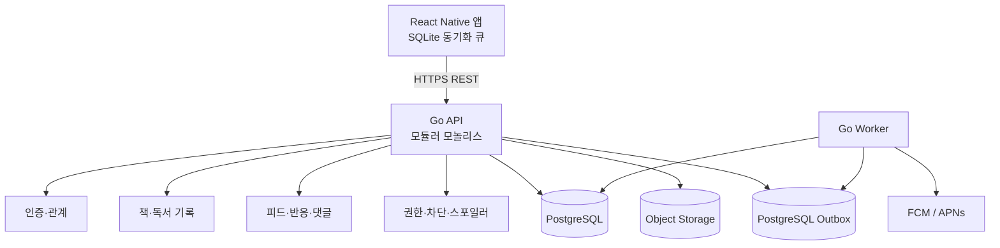
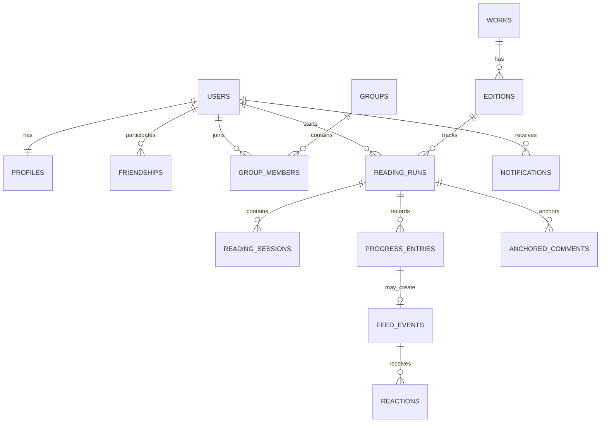

# 책결 기술 설계서

- 문서 상태: MVP 구현 기준안
- 기준일: 2026-08-25
- 권장 구조: React Native 모바일 + Go 모듈러 모놀리스 + PostgreSQL

## 1. 기술 목표

- 한 팀이 iOS·Android와 백엔드를 빠르게 출시할 수 있어야 한다.
- 독서 기록은 오프라인에서도 잃지 않아야 한다.
- 공개 범위 변경과 차단은 기존 피드에도 즉시 적용되어야 한다.
- 페이지가 다른 에디션과 오디오북을 하나의 진척 축으로 비교해야 한다.
- 스포일러 댓글은 API 응답 단계에서 차단해야 한다.
- 초기에는 운영 복잡도를 낮추되 기능별 경계를 분명히 한다.

## 2. 권장 스택

| 영역 | 권장안 | 이유 |
|---|---|---|
| 모바일 | React Native + Expo + TypeScript | 단일 코드베이스, 빠른 배포, 알림·카메라·딥링크 지원 |
| 로컬 저장 | SQLite | 오프라인 세션과 동기화 큐 보존 |
| API | Go 표준 HTTP 또는 경량 라우터 | 명시적 동시성·트랜잭션, 작은 운영 면적 |
| DB | PostgreSQL | 관계·권한·피드 조회와 트랜잭션에 적합 |
| 파일 | S3 호환 오브젝트 스토리지 | 프로필·메모 이미지 저장 |
| 인증 | 개인 계정 + bcrypt + 해시 세션 | 외부 Auth 없이 한 명이 안전하게 사용, 향후 JWT 검증 병행 가능 |
| 푸시 | FCM을 통한 Android/APNs 전달 | 양 플랫폼 알림 통합 |
| 배포 | 컨테이너 1개 + 관리형 PostgreSQL | 초기 운영 단순화 |
| 관측 | 구조화 로그, 오류 추적, OpenTelemetry | 개인정보를 제외한 요청·잡 추적 |

Flutter가 팀의 주력 기술이면 모바일만 교체해도 API와 데이터 모델은 유지된다.

### 2.1 확정된 1안 구현

- Expo SDK 57, Expo Router Native Tabs, TypeScript
- TanStack Query 5, Zod 4
- Expo SQLite 기반 캐시와 동기화 큐
- Expo Camera 기반 ISBN 바코드 인식
- Go 표준 `net/http`, pgx 5, PostgreSQL 17
- PostgreSQL Outbox와 별도 Go Worker
- 첫 계정만 허용하는 Go 인증 API, bcrypt 자격 증명, 30일 불투명 세션
- Android SecureStore 세션과 PostgreSQL 토큰 해시 저장
- Kakao 도서 검색 API와 PostgreSQL 로컬 카탈로그 폴백

현재 구현은 `개인 로그인 → 책 검색/ISBN 스캔 → 독서 회차 생성 → 진척 기록 → SQLite 대기열 → Go API → PostgreSQL → 피드/Outbox`의 수직 흐름을 완성했다. 이 흐름을 나누면 오프라인 재전송 때 진척만 반영되거나 같은 피드가 중복되는 현상이 생기므로 `client_operation_id` 고유 제약과 단일 DB 트랜잭션을 사용한다.

## 3. 시스템 구조



API와 Worker는 동일 코드베이스의 서로 다른 실행 명령으로 둔다. Redis, 메시지 브로커, 검색 전용 엔진은 실제 병목이 나타날 때 추가한다.

## 4. 모듈 경계

```text
accounts      인증, 프로필, 기기, 계정 삭제
relationships 친구 요청, 수락, 차단, 초대 링크
catalog       작품, 에디션, 저자, 검색 공급자 어댑터
library       사용자 책장과 독서 회차
reading       세션, 진척, 타이머, 정규화
social        피드 이벤트, 반응, 댓글
groups        그룹, 멤버, 그룹 독서
privacy       가시성 판정과 스포일러 잠금
notifications outbox, 푸시, 묶음 알림, 음소거
moderation    신고, 제재, 감사 로그
analytics     제품 이벤트와 주간 리포트
```

모듈은 서로의 테이블을 직접 수정하지 않고 공개한 서비스 메서드나 도메인 이벤트로 협력한다. 단, MVP에서는 같은 프로세스와 같은 DB 트랜잭션을 사용한다.

## 5. 핵심 데이터 모델



### 5.1 주요 테이블

#### `users`

- `id uuid primary key`
- `status active|suspended|deleting`
- `locale`, `timezone`
- `created_at`, `deleted_at`

#### `identities`

- `user_id`
- `provider apple|google|kakao`
- `provider_subject`
- 고유 키: `(provider, provider_subject)`

이메일을 사용자 식별의 주키로 사용하지 않는다.

#### `friendships`

- `id`
- `requester_id`, `addressee_id`
- `status pending|accepted|declined|removed`
- `created_at`, `accepted_at`
- 두 사용자 ID를 정렬한 `pair_key`에 고유 제약을 둔다.

차단은 `blocks(blocker_id, blocked_id)`에 별도로 저장한다. 차단 여부는 친구 상태보다 우선한다.

#### `groups`, `group_members`

- 그룹: `id`, `owner_id`, `name`, `visibility private|invite_only`, `max_members`
- 멤버: `group_id`, `user_id`, `role owner|admin|member`, `status`

MVP에서 공개 그룹은 지원하지 않는다.

#### `works`, `editions`

- 작품은 언어·판형을 넘는 논리적 책 단위다.
- 에디션은 ISBN, 출판사, 언어, 총 페이지, 오디오 길이를 가진다.
- 외부 공급자의 ID는 `catalog_external_ids`에 분리한다.
- 잘못 병합된 작품을 운영자가 분리할 수 있도록 원본 공급자 값을 보존한다.

#### `reading_runs`

- `id`, `user_id`, `edition_id`
- `status want_to_read|reading|paused|finished|dnf`
- `started_at`, `finished_at`
- `progress_basis pages|percent|audio_seconds`
- `current_value`, `total_value`
- `normalized_progress int` — 0~10000 basis points
- `visibility private|friends|group|public`
- `progress_precision hidden|milestone|exact`
- `auto_share boolean`
- `run_number` — 재독 회차

#### `reading_sessions`

- `id`, `reading_run_id`, `client_operation_id`
- `started_at`, `ended_at`, `duration_seconds`
- `start_value`, `end_value`
- `source timer|manual|import`
- `client_created_at`, `server_received_at`

`client_operation_id`는 오프라인 재전송의 멱등 키다.

#### `progress_entries`

- 변경 전후 값과 정규화 진척
- `recorded_at`, `created_at`, `corrected_at`
- `source`, `client_operation_id`
- 삭제 대신 수정 이력을 남긴다.

#### `feed_events`

- `actor_id`, `reading_run_id`, `progress_entry_id`
- `type started|milestone_25|milestone_50|milestone_75|finished|dnf|shared_note|weekly_group`
- `visibility`, `group_id nullable`
- `occurred_at`, `created_at`, `superseded_at`

이벤트에 허용 사용자 목록을 복사하지 않는다. 조회 시 현재 관계와 공개 범위를 판정해 친구 해제·차단·정책 변경을 즉시 반영한다.

#### `anchored_comments`

- `author_id`, `reading_run_id`, `work_id`
- `anchor_basis pages|percent|chapter|finished`
- `anchor_value`, `normalized_anchor`
- `unlock_rule always|after_position|after_finish`
- `body_ciphertext`, `created_at`, `deleted_at`

잠긴 사용자의 응답에는 본문 필드를 포함하지 않는다.

#### `reactions`

- `event_id`, `user_id`, `kind cheer|curious|together`
- 고유 키: `(event_id, user_id, kind)`

#### `outbox_events`

- `id`, `topic`, `aggregate_id`, `payload`, `available_at`, `processed_at`, `attempts`
- 도메인 변경과 같은 트랜잭션으로 저장한다.

## 6. 진척 정규화

모든 진척은 `0..10000` 범위의 정수로 정규화한다.

```text
페이지: round(current_page / total_pages * 10000)
퍼센트: round(percent * 100)
오디오: round(current_seconds / total_seconds * 10000)
```

부동소수점 비교를 피하고 에디션이 달라도 스포일러 잠금을 비교할 수 있다. 페이지 총수가 바뀌면 현재 값과 모든 앵커를 다시 계산하되 원래 입력값은 보존한다.

마일스톤은 2500, 5000, 7500, 10000을 처음 상향 통과할 때 생성한다. 진척 수정으로 아래로 내려간 경우 이미 본 친구의 이벤트를 재발행하지 않고 기존 이벤트를 `superseded` 처리한다.

## 7. API 설계

REST와 JSON을 사용하고 `/v1`에서 시작한다. 모든 쓰기 요청은 `Idempotency-Key`를 받을 수 있어야 한다.

### 7.1 인증·프로필

```text
GET    /v1/auth/status
POST   /v1/auth/register
POST   /v1/auth/login
POST   /v1/auth/logout
POST   /v1/me/bootstrap
GET    /v1/me
PATCH  /v1/me
DELETE /v1/me
GET    /v1/me/export
GET    /v1/me/storage-status
```

최초 가입은 PostgreSQL advisory transaction lock으로 직렬화해 동시에 두 계정이 만들어지는 것을 막는다. 비밀번호는 bcrypt 해시만 보관하고, 256비트 무작위 세션 토큰은 클라이언트에 한 번만 반환한 뒤 서버에는 SHA-256 해시만 저장한다. 기본 만료는 30일이며 로그아웃·계정 삭제 시 폐기한다.

### 7.2 친구·그룹

```text
POST   /v1/invites
POST   /v1/invites/{token}/accept
GET    /v1/friends
DELETE /v1/friends/{userId}
POST   /v1/blocks/{userId}
DELETE /v1/blocks/{userId}
POST   /v1/groups
POST   /v1/groups/{groupId}/invites
PATCH  /v1/groups/{groupId}/members/{userId}
```

### 7.3 책장·독서

```text
GET    /v1/catalog/books?query=&limit=
GET    /v1/catalog/books/{isbn}
POST   /v1/reading-runs
GET    /v1/reading-runs?status=reading
PATCH  /v1/reading-runs/{runId}
POST   /v1/reading-runs/{runId}/sessions
POST   /v1/reading-runs/{runId}/progress
GET    /v1/reading-runs/{runId}/timeline
```

### 7.4 피드·대화

```text
GET    /v1/feed?cursor=&limit=
POST   /v1/feed-events/{eventId}/reactions
DELETE /v1/feed-events/{eventId}/reactions/{kind}
POST   /v1/works/{workId}/comments
GET    /v1/works/{workId}/comments?cursor=
POST   /v1/comments/{commentId}/replies
POST   /v1/reports
```

피드는 `(occurred_at, id)` 기반 키셋 커서를 사용한다. 페이지 번호 기반 `offset`은 새 이벤트가 들어올 때 중복과 누락을 만든다.

### 7.5 응답 예시

```json
{
  "eventId": "evt_01",
  "actor": { "id": "usr_02", "displayName": "지연" },
  "book": { "workId": "wrk_01", "title": "파친코" },
  "type": "milestone_50",
  "progress": {
    "precision": "milestone",
    "normalized": 5000,
    "display": "50%"
  },
  "viewer": {
    "canReact": true,
    "canComment": true,
    "relationship": "friend"
  },
  "occurredAt": "2026-08-20T10:30:00+09:00"
}
```

권한 결과를 `viewer`에 포함해 클라이언트가 서버 정책을 추측하지 않게 한다.

## 8. 권한 판정

모든 읽기 요청은 다음 순서로 판정한다.

1. 요청자와 소유자의 차단 관계 확인
2. 소유자 본인인지 확인
3. 콘텐츠 삭제·제재 상태 확인
4. 공개 범위 확인
5. 친구 또는 그룹 멤버십 확인
6. 진척 정밀도에 맞게 필드 마스킹
7. 댓글 앵커와 요청자의 해당 작품 진척 비교

순서가 바뀌어 공개 범위를 먼저 캐시하면 차단 직후에도 기존 피드나 알림 미리보기에 정보가 남는 현상이 생긴다. 따라서 차단은 항상 최우선이며 캐시 키에도 관계 버전을 포함한다.

### 8.1 공개 범위 표

| 범위 | 본인 | 수락 친구 | 지정 그룹 | 기타 사용자 |
|---|---:|---:|---:|---:|
| private | 허용 | 거부 | 거부 | 거부 |
| friends | 허용 | 허용 | 친구인 경우 | 거부 |
| group | 허용 | 지정 그룹이면 허용 | 허용 | 거부 |
| public | 허용 | 허용 | 허용 | 공유 링크에서 허용 |

## 9. 주요 쓰기 흐름

### 9.1 진척 기록 트랜잭션

1. 사용자와 독서 회차 소유권 확인
2. `client_operation_id` 중복 확인
3. 새 진척 검증과 정규화
4. `progress_entries` 추가
5. `reading_runs.current_value` 갱신
6. 처음 통과한 마일스톤 계산
7. 필요하면 `feed_events`와 `outbox_events` 추가
8. 한 트랜잭션으로 커밋

피드 생성과 진척 저장을 다른 트랜잭션으로 나누면 앱에는 50%로 보이는데 친구 피드에는 이벤트가 없거나, 재시도 때 같은 이벤트가 두 번 생길 수 있다.

### 9.2 댓글 조회

1. 작품 기준으로 댓글 후보를 조회
2. 요청자의 해당 작품 최고 정규화 진척을 조회
3. 각 댓글의 잠금 규칙을 서버에서 판정
4. 잠긴 댓글은 `body` 없이 `locked=true`, `unlockAt=5200`만 반환
5. 이미지 서명 URL도 열린 댓글에만 생성

클라이언트에 암호문이나 숨긴 본문을 보내 CSS로 가리는 방식은 사용하지 않는다.

## 10. 오프라인 동기화

모바일은 쓰기 작업을 SQLite의 `pending_operations`에 먼저 기록한다.

- 각 작업은 UUID `client_operation_id`를 가진다.
- 서버 성공 전까지 로컬 타임라인에 `동기화 중`으로 표시한다.
- 네트워크 복구 시 생성 순으로 재전송한다.
- 4xx 검증 오류는 사용자 수정 대상으로 남긴다.
- 5xx와 네트워크 오류는 지수 백오프로 재시도한다.
- 동일 작업 재전송은 서버의 고유 제약으로 한 번만 반영한다.

여러 기기에서 진척이 충돌하면 서버 수신 시간이 아니라 `recorded_at`과 진척값을 함께 본다. 기본은 더 최신 기록을 채택하되 진척 감소는 명시적 `correction=true`가 있어야 허용한다.

## 11. 피드 조회 전략

MVP에서는 fan-out on read를 사용한다.

```text
feed_events
  JOIN friendships / group_members
  LEFT JOIN blocks
  WHERE viewer가 현재 볼 수 있는 이벤트
  ORDER BY occurred_at DESC, id DESC
  LIMIT 30
```

이 방식은 친구 해제와 공개 범위 변경이 즉시 반영되고, 초기 사용자 규모에서 운영이 단순하다. 피드 p95가 300ms를 넘거나 활성 친구 수가 수백 명으로 늘면 사용자별 inbox materialization을 검토한다.

필수 인덱스:

- `feed_events(actor_id, occurred_at desc, id desc)`
- `friendships(pair_key, status)`
- `group_members(user_id, group_id, status)`
- `reading_runs(user_id, status, updated_at desc)`
- `progress_entries(reading_run_id, recorded_at desc)`
- `anchored_comments(work_id, normalized_anchor, created_at)`

## 12. 알림과 작업 처리

진척 트랜잭션에서 직접 푸시를 보내지 않는다. DB outbox를 Worker가 읽어 처리한다.

- 친구 요청, 답글: 즉시 큐
- 마일스톤: 사용자별 하루 묶음
- 스포일러 댓글 잠금 해제: 진척 기록 후 계산
- 주간 공동 리포트: 사용자 시간대 월요일 저녁 기본
- 실패 작업: 제한된 재시도 후 dead-letter 상태와 운영 경고

푸시 본문에는 잠긴 댓글 내용, 정확한 비공개 진척, 책별 비공개 설정을 포함하지 않는다.

## 13. 보안·개인정보

- 전 구간 TLS, 저장소 암호화, 비밀은 배포 환경의 secret manager 사용
- 액세스 토큰은 짧게, 리프레시 토큰은 기기별 회전 및 폐기
- 이미지 업로드는 크기·MIME·악성 파일 검사 후 재인코딩
- 로그에 토큰, 이메일, 댓글 본문, 초대 링크 원문을 기록하지 않음
- 초대 토큰은 해시만 저장하고 만료·1회 사용을 지원
- 계정 삭제 요청 즉시 로그인과 공유를 중단하고 법정 보존 대상을 제외해 비동기 삭제
- 현재 운영자 콘솔은 강한 공유 키, 사유 입력, 감사 로그를 사용한다. 운영 배포에서는 앞단 IAP/SSO로 개인별 신원과 역할을 강제한다.
- 신고된 콘텐츠 외 일반 개인 메모는 운영 도구 검색 대상에서 제외

## 14. 관측과 제품 이벤트

기술 지표:

- API 요청 수, 오류율, p50/p95/p99
- DB 쿼리 시간과 connection saturation
- 오프라인 동기화 실패율
- outbox 지연과 재시도 수
- 푸시 전달 실패율
- 스포일러 권한 판정 오류 테스트 수

제품 이벤트:

```text
signup_completed
book_added
progress_recorded
invite_created
friend_connected
feed_viewed
reaction_added
comment_created
locked_comment_unlocked
privacy_changed
notification_muted
```

이벤트에는 댓글 원문과 책 메모를 넣지 않는다.

## 15. 테스트 전략

### 단위 테스트

- 진척 정규화와 마일스톤 경계
- 진척 감소 수정
- 공개 범위·친구·그룹·차단 조합
- 스포일러 잠금과 완독 후 공개
- 같은 작업 멱등 처리

### 통합 테스트

- 진척·피드·outbox 원자적 커밋
- 친구 해제·차단 후 기존 피드 제거
- 서로 다른 에디션의 잠금 해제
- 계정 삭제와 데이터 내보내기
- 키셋 페이지네이션 중 새 이벤트 삽입

### 모바일 테스트

- 오프라인 타이머 종료 후 재연결
- 앱 강제 종료 뒤 진행 중 타이머 복구
- 딥링크 초대 수락
- 푸시에서 잠긴 댓글 내용 비노출
- 접근성 글자 확대와 스크린리더

## 16. 구현 순서

1. **카탈로그·책장·독서 회차**
2. **오프라인 세션·진척 정규화**
3. **초대·친구·차단**
4. **마일스톤 피드·반응**
5. **앵커 댓글·스포일러 잠금**
6. **그룹·공동 주간 리포트**
7. **푸시·신고·삭제·내보내기**
8. **베타 계측과 운영 도구**

이 순서보다 피드를 먼저 만들면 표시할 신뢰할 만한 독서 이벤트가 없고, 권한보다 알림을 먼저 만들면 차단·공개 범위 변경 후에도 민감한 내용이 푸시에 남는다. 스포일러 기능은 진척 정규화가 안정된 뒤 구현해야 에디션이 다른 친구의 댓글이 너무 일찍 열리는 오류를 막을 수 있다.

## 17. 권장 저장소 구조

```text
book/
  apps/
    mobile/                 React Native 앱
  cmd/
    api/                    Go API 진입점
    worker/                 비동기 작업 진입점
  internal/
    accounts/
    relationships/
    catalog/
    library/
    reading/
    social/
    groups/
    privacy/
    notifications/
    moderation/
  migrations/
  api/
    openapi.yaml
  docs/
  deploy/
```

## 18. 개발과 병행할 스파이크

다음 제품 슬라이스에 들어가기 전에 2~3일 범위로 아래 세 가지를 검증한다.

1. 국내 도서 검색 공급자의 ISBN·표지·총 페이지 품질과 캐시·재배포 조건
2. Expo에서 백그라운드 타이머 종료, 딥링크, FCM/APNs 동작
3. PostgreSQL 한 쿼리에서 차단·친구·그룹·공개 범위를 적용한 피드 성능

스파이크 결과가 기준을 충족하면 모듈러 모놀리스로 구현을 시작하고, 그렇지 않으면 해당 영역만 대안을 선택한다.
